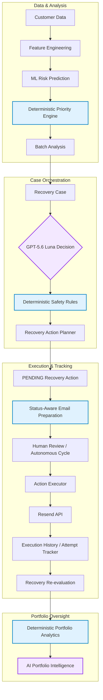

# AI Revenue Recovery

AI Revenue Recovery is a sophisticated, AI-assisted platform designed to identify, prioritize, and recover revenue from at-risk customer accounts. The system blends deterministic business logic with the reasoning capabilities of GPT-5.6 Luna to orchestrate the entire recovery lifecycle—from risk prediction and priority scoring to generating status-aware customer communications. To ensure strict operational safety, the platform utilizes a robust deterministic boundary layer that governs all AI decisions, ensuring the AI cannot bypass recovery limits, invent financial data, or autonomously dispatch emails without human review or controlled boundaries. Ultimately, approved recovery actions result in targeted, highly personalized emails executed securely via Resend.

## Screenshots / Demo

<!-- SCREENSHOT: Main Dashboard -->
<!-- Add screenshot here: docs/screenshots/dashboard.png -->

<!-- SCREENSHOT: Customer Risk Analysis -->
<!-- Add screenshot here: docs/screenshots/customer-risk.png -->

<!-- SCREENSHOT: Recovery Case Detail -->
<!-- Add screenshot here: docs/screenshots/recovery-case-detail.png -->

<!-- SCREENSHOT: AI Recovery Communication / Email Preview -->
<!-- Add screenshot here: docs/screenshots/email-preview.png -->

<!-- SCREENSHOT: Portfolio Analytics -->
<!-- Add screenshot here: docs/screenshots/portfolio-analytics.png -->

<!-- SCREENSHOT: AI Portfolio Intelligence -->
<!-- Add screenshot here: docs/screenshots/ai-portfolio.png -->

## Feature Overview

| Feature | Description |
|---------|-------------|
| **ML Risk Prediction** | Identifies accounts at risk of payment failure using historical features and simulated predictive models. |
| **Deterministic Priority Scoring** | Calculates a strict, rule-based priority score based on risk levels and exposed revenue. |
| **Recovery Orchestration** | Combines AI reasoning with deterministic boundaries to decide whether to CONTINUE, STOP, or ESCALATE a case. |
| **Action Planning** | Translates orchestration decisions into concrete, `PENDING` recovery actions (e.g., `RECOVERY_CONTACT`). |
| **Status-Aware Email Prep** | Dynamically prepares email intents (e.g., `PAYMENT_REMINDER`, `URGENT_RECOVERY`) based on the case's exact status and attempt history. |
| **Controlled Email Execution** | Safely dispatches prepared recovery communications via Resend to a restricted sandbox recipient. |
| **Audit & Execution History** | Maintains an immutable log (`ExecutionAttempt`) of every action execution (Success, Failed, Blocked). |
| **Bounded Autonomous Recovery** | Executes automated recovery cycles across the portfolio, strictly bounded by maximum cycles and attempt limits to prevent runaway loops. |
| **Scheduled Processing** | A background scheduler that automatically evaluates and executes due or overdue recovery actions at configurable intervals. |
| **Portfolio Analytics** | A comprehensive dashboard aggregating financial exposure, risk distributions, and recovery effectiveness across the entire platform. |
| **AI Portfolio Intelligence** | An advisory AI layer that analyzes deterministic portfolio metrics to identify risk concentrations and recommend human focus areas. |
| **INR Financial Reporting** | Natively handles all monetary metrics as Indian Rupees (INR) with localized numerical grouping and formatting. |

## System Architecture



## Core AI Safety Architecture

A foundational principle of this project is that **GPT is NOT the final authority**. 

While AI excels at parsing context and generating personalized communication, it operates entirely within a strict deterministic framework:
*   **Safety Boundaries**: Python business rules enforce that `Completed` cases, `Escalated` cases, and accounts that have reached `max_attempts` cannot receive further communication. GPT cannot override these rules.
*   **Execution Locks**: GPT cannot directly dispatch emails, interact with the Resend API, or mutate financial tables. It simply recommends orchestration pathways (`CONTINUE`, `STOP`, `ESCALATE`) and drafts personalized text.
*   **Separation of Concerns**: 
    *   **Case-level AI**: Aids in micro-level recovery decisions (e.g., assessing a single customer's payment history).
    *   **Portfolio-level AI**: Acts purely as an advisory intelligence layer, summarizing systemic risks without the ability to mutate state.

## Recovery Workflow


## AI Recovery Decision

The platform utilizes **GPT-5.6 Luna** via the official OpenAI SDK. The orchestrator supplies the model with a tightly scoped context containing the customer's financial exposure, risk level, and historical attempt counts. The model must return a strictly validated JSON response recommending a decision (`CONTINUE`, `STOP`, `ESCALATE`). 

If the AI returns invalid JSON, fails schema validation, or violates logical safety boundaries, the system catches the error safely and falls back to deterministic state handling, ensuring no runaway or unsafe actions occur.

## Recovery Actions

Recovery operations revolve around the `RecoveryAction` model. Actions are born in a `PENDING` state and include types such as:
*   `RECOVERY_CONTACT`: A directive to communicate with the customer.
*   `ESCALATION_REVIEW`: A directive requiring human intervention.
*   `NO_ACTION`: A deliberate halt in the pipeline.

Actions progress from `PENDING` to `EXECUTED` strictly through the backend Action Executor.

## Email Recovery

Before any email is sent, the system utilizes a **status-aware communication intent layer**. 
Instead of relying on AI to blindly write an email, the backend evaluates the case state and selects a deterministic intent:
*   `PAYMENT_REMINDER`: Standard initial contact.
*   `PAYMENT_ASSISTANCE`: Helpful outreach for medium-risk accounts.
*   `URGENT_RECOVERY`: Escalated tone for high-risk accounts.
*   `FOLLOW_UP_REMINDER`: Used when prior attempts have been made.
*   `ESCALATION_NOTICE`: Informs the customer of human review.
*   `CASE_RESOLUTION` & `PAYMENT_CONFIRMATION`: Concludes successful recoveries.

*Note: Promise-to-Pay intents (`PROMISE_REMINDER`, `MISSED_PROMISE`) are intentionally deferred pending future data-model expansions.*

Once prepared, the email is surfaced in the UI for Human Review. Clicking `[ Send Email ]` dispatches the request to the Action Executor, which routes it through Resend and logs an `ExecutionAttempt`. **Preparing an email does not send it.**

## Autonomous Recovery

The platform includes a **Bounded Autonomous Recovery** loop (`POST /recovery/cases/{case_id}/run-autonomous`). When triggered, the system repeatedly loops through orchestration, planning, and execution. 
Crucially, this is bounded by a strict `max_cycles` limit and standard safety rules (e.g., reaching `max_attempts` immediately halts the loop).

## Scheduled Recovery

A background scheduled processor (`api/services/scheduled_recovery_processor.py`) can be enabled to process overdue `PENDING` actions automatically. It respects batch size limits and triggers the existing Action Executor logic safely, without requiring realtime GPT orchestration for the execution phase.

## Portfolio Analytics

The platform aggregates operational data into a high-level dashboard. Key metrics include:
*   Total, Active, Completed, and Escalated cases.
*   Revenue at Risk vs. Revenue Recovered (with Recovery Rate).
*   Execution activity (Pending, Executed, Failed, Blocked).
*   Risk and Priority distributions.
All monetary values are natively parsed and displayed as INR.

## AI Portfolio Intelligence

Phase 11C introduces an advisory AI layer designed to answer: *"What deserves attention and why?"*
By analyzing the deterministic portfolio analytics, GPT highlights risk concentrations, overdue actions, and repeated failures. 

**This feature is strictly advisory.** It requires manual user triggering, does not mutate database records, cannot dispatch emails, and fails safely if the portfolio is empty.

## Tech Stack

**Frontend**:
*   React 18 & TypeScript
*   Vite
*   Tailwind CSS
*   Recharts
*   Lucide React

**Backend**:
*   Python 3.11 & FastAPI
*   SQLAlchemy & SQLite (Local Data Store)
*   OpenAI SDK (GPT-5.6 Luna)
*   Resend (Email Delivery)

## Project Structure

```text
ai-revenue-recovery/
├── api/
│   ├── models.py           # SQLAlchemy database schemas
│   ├── main.py             # FastAPI entrypoint & endpoints
│   ├── database.py         # SQLite connection management
│   └── services/           # Core business logic
│       ├── action_executor.py
│       ├── portfolio_ai_insights.py
│       ├── portfolio_analytics.py
│       ├── recovery_action_planner.py
│       ├── recovery_email_service.py
│       ├── recovery_orchestrator.py
│       └── scheduled_recovery_processor.py
├── frontend/
│   ├── package.json
│   └── src/
│       ├── components/
│       ├── pages/          # React views (Analytics, Cases, etc.)
│       ├── services/       # Frontend API client
│       └── utils/          # Formatters (e.g., INR localization)
├── data/                   # SQLite local storage
├── tests/                  # 160+ Backend regression tests
└── README.md
```

## Setup

1. **Clone the repository**:
   ```bash
   git clone <repository-url>
   cd ai-revenue-recovery
   ```

2. **Backend Environment**:
   ```bash
   python3 -m venv venv
   source venv/bin/activate
   pip install -r requirements.txt
   ```

3. **Environment Variables**:
   Create a `.env` file in the root directory (see *Environment Variables* section below).

4. **Start the FastAPI Backend**:
   ```bash
   uvicorn api.main:app --reload
   ```

5. **Start the Frontend**:
   ```bash
   cd frontend
   npm install
   npm run dev
   ```

6. **Open the Application**:
   Navigate to `http://localhost:5173` in your browser.

## Environment Variables

| Variable | Purpose | Required |
|----------|---------|----------|
| `OPENAI_API_KEY` | Authenticates GPT-5.6 Luna orchestration & insights | Yes |
| `OPENAI_MODEL` | Specifies the model (defaults to `gpt-5.6-luna`) | No |
| `RESEND_API_KEY` | Authenticates outgoing transactional emails | Yes |
| `RECOVERY_TEST_EMAIL` | Sandboxed recipient for all executed emails | Yes |
| `RECOVERY_SCHEDULER_ENABLED` | Toggles background automated processing (`true`/`false`) | No |
| `RECOVERY_SCHEDULER_INTERVAL_SECONDS` | Scheduler tick rate (defaults to `60`) | No |

## Email Sandbox

To prevent accidental outreach during development, all email executions are strictly sandboxed. Regardless of the actual customer's contact details, the Action Executor securely overrides the outgoing recipient with the value provided in `RECOVERY_TEST_EMAIL`. Real emails are delivered to this sandbox address via Resend.

## Financial Data

The system is localized for the Indian market. All numerical monetary values stored in the database are natively treated as Indian Rupees (INR).
*   The frontend uses a centralized formatter to display values using the `₹` symbol and Indian numeral grouping (e.g., `39177` → `₹39,177`).
*   No USD → INR exchange rate conversions occur.

## Security & Safety

*   **Secret Management**: API keys and tokens are rigorously excluded from the codebase and managed entirely via `.env`.
*   **Immutable Audits**: Executed actions cannot be deleted; they generate permanent `ExecutionAttempt` records mapping success/failure/blocks.
*   **Safe Orchestration**: The AI is walled off from executing actions. Financial state mutations (like increasing `amount_recovered`) are decoupled entirely from the act of sending an email.

## API Endpoints (Core)

**Recovery Cases**
*   `GET /recovery/cases` - List all cases
*   `GET /recovery/cases/{case_id}` - Retrieve case details
*   `POST /recovery/cases/{case_id}/orchestrate` - Run AI decision logic
*   `POST /recovery/cases/{case_id}/plan-action` - Plan next recovery step

**Execution & Analytics**
*   `GET /recovery/cases/{case_id}/prepare-email` - Preview intent-aware email
*   `POST /recovery/actions/{action_id}/execute` - Dispatch email via Resend
*   `GET /recovery/analytics/portfolio` - Fetch deterministic KPIs
*   `POST /recovery/analytics/portfolio/ai-insights` - Generate AI advisory report

## Testing

The backend is fortified by a comprehensive test suite of over 160 regression tests ensuring safety boundaries and AI parsing resilience. External network calls (OpenAI, Resend) are aggressively mocked to ensure tests run offline.

```bash
# Run the complete regression suite
source venv/bin/activate
python -m unittest discover -p "test_*.py"
```

## Roadmap

- [x] **Phase 7** — Priority Engine & Batch Analysis
- [x] **Phase 8** — Recovery Orchestration & Action Planning
- [x] **Phase 9** — Execution, Audits & Recovery Attempt Tracking
- [x] **Phase 10** — Controlled & Bounded Autonomous Recovery
- [x] **Phase 11** — Scheduled Processing, Portfolio Analytics & AI Insights
- [ ] **Phase 12** — Production Deployment & PostgreSQL Migration

## Example Recovery Scenario

1. **Risk Detection**: The ML pipeline identifies Customer 8681 as having an elevated failure risk on an outstanding balance of ₹39,177.
2. **Case Creation**: A `RecoveryCase` is generated and assigned a high Priority Score based on the financial exposure.
3. **Orchestration**: The user requests a recovery plan. GPT-5.6 Luna reviews the case context and recommends `CONTINUE` with a polite follow-up strategy.
4. **Action Planning**: The deterministic backend verifies the case is not completed or escalated, and provisions a `PENDING` `RECOVERY_CONTACT` action.
5. **Email Preparation**: The Email Service evaluates the case (First contact + Medium Risk) and selects the `PAYMENT_ASSISTANCE` intent, drafting a highly personalized email.
6. **Execution**: The human agent reviews the draft in the UI and clicks *Send Email*.
7. **Delivery & Audit**: The Action Executor bypasses the real customer email, routes the message to the sandbox address via Resend, updates the Attempt Count, and records an `ExecutionAttempt` for the audit log.
